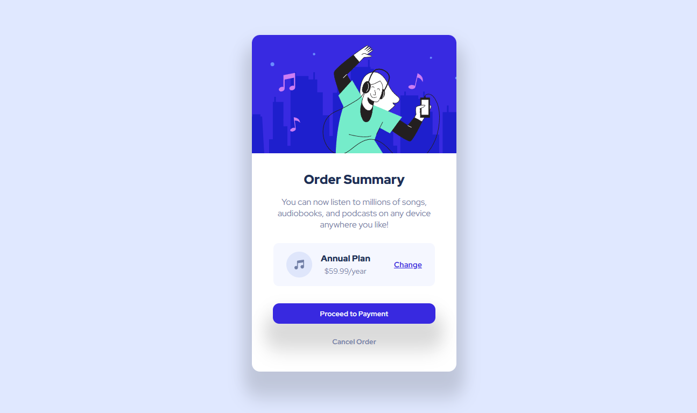

# Order Summary Card Component

## 🎯 Sobre o Projeto

Um componente de resumo de pedido responsivo desenvolvido com HTML e CSS, seguindo um design moderno com efeitos hover interativos.

## 🖼️ Preview do Projeto



## ✨ Funcionalidades

✅ Design 100% responsivo para todos os dispositivos  
✅ Efeitos hover interativos nos botões e links  
✅ Layout semântico e acessível  
✅ Tipografia customizada com a fonte Red Hat Display  
✅ Sombras realistas e bordas arredondadas  
✅ Transições suaves e animações CSS

## 🛠️ Tecnologias Utilizadas

- **HTML5** - Estrutura semântica
- **CSS3** - Estilização moderna
- **Flexbox** - Layouts flexíveis
- **Media Queries** - Responsividade
- **Box-shadow** - Efeitos de profundidade
- **Transitions** - Animações suaves

## 🎨 Características do Design

**Cores:**

- Fundo principal: `hsl(225, 100%, 94%)`
- Card: `hsl(0, 0%, 100%)`
- Plano: `hsl(225, 100%, 98%)`
- Texto principal: `hsl(223, 47%, 23%)`
- Texto secundário: `hsl(224, 23%, 55%)`
- Destaque: `hsl(245, 75%, 52%)`

**Tipografia:** Red Hat Display (300-900)  
**Layout:** Card centralizado com sombras múltiplas

## 📱 Responsividade

O projeto é totalmente responsivo com breakpoints para:

- **Desktop:** 1440px+
- **Tablet:** 768px
- **Mobile:** 375px

## 🚀 Como Executar

```bash
# Clone o repositório
git clone https://github.com/seu-usuario/order-summary-card.git

# Abra o arquivo index.html no navegador
# ou use uma extensão Live Server no VS Code
```
